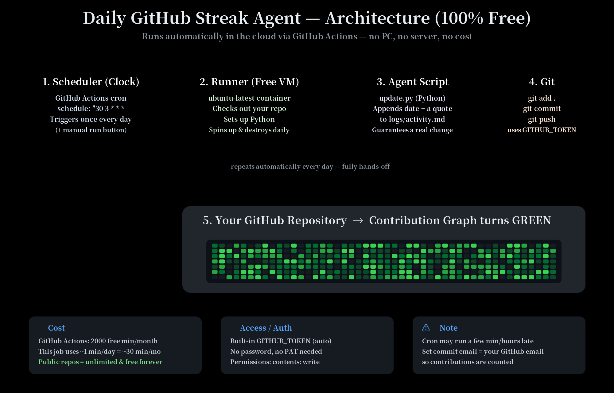

# 🟢 Daily GitHub Streak Agent

An automated agent that commits to your GitHub repo **once every day** so your
contribution graph stays green — with **zero cost** and **no PC required**.
It runs entirely in **GitHub Actions** (GitHub's free cloud).



---

## ⚠️ Honest disclaimer (read this first)

This is meant as a **learning / streak-maintenance helper**. It commits real,
small content (a dated log + a rotating quote) every day. It does **not** make
you a better engineer, and "fake green squares" do not impress serious
recruiters. Use it to build a *real* daily habit, not to fool anyone. 🙂

---

## 🧠 How it works (architecture)

| # | Component | What it does |
|---|-----------|--------------|
| 1 | **Scheduler** | GitHub Actions `cron` fires once a day (and a manual button) |
| 2 | **Runner** | A free `ubuntu-latest` VM spins up, checks out your repo, installs Python |
| 3 | **Agent script** | `scripts/update.py` appends today's date + a quote to `logs/activity.md` |
| 4 | **Git** | The workflow commits the change and pushes it using the built-in token |
| 5 | **Your repo** | The new commit lands → your contribution graph turns green ✅ |

Everything repeats automatically every day — fully hands-off.

---

## 🚀 Setup (5 minutes, one time)

### 1. Create a GitHub repository
- Go to https://github.com/new
- Name it e.g. `daily-streak`
- **Public** repo = unlimited free Actions minutes (recommended)
- Create it.

### 2. Add these files to the repo
Copy the contents of this folder into your repo:
```
.github/workflows/daily-commit.yml
scripts/update.py
logs/.gitkeep
README.md
```
You can do this via the GitHub web UI ("Add file" → "Upload files"),
or with git:
```bash
git clone https://github.com/<you>/daily-streak.git
cd daily-streak
# copy the files in, then:
git add .
git commit -m "init daily streak agent"
git push
```

### 3. Set your timezone (optional)
Open `scripts/update.py` and set `TZ_OFFSET_HOURS` to your timezone
(India = `5.5`). Set the cron time in the workflow if you want a specific
hour — remember **cron is in UTC**. Use https://crontab.guru to convert.

### 4. Make commits count for YOUR graph (important!)
By default the workflow commits as the GitHub Actions bot. Bot commits show
up but may not count for *you*. To count for your profile, edit the email in
`.github/workflows/daily-commit.yml`:

```yaml
git config user.email "YOUR_GITHUB_USERNAME@users.noreply.github.com"
git config user.name  "YOUR_GITHUB_USERNAME"
```
Find your no-reply email at: GitHub → Settings → Emails.

### 5. Enable Actions write permission
Repo → **Settings → Actions → General → Workflow permissions** →
select **"Read and write permissions"** → Save.

### 6. Test it now
Go to the **Actions** tab → "Daily Streak Commit" → **Run workflow**.
Watch it run, then check your repo — there should be a new commit. 🎉

---

## ⏰ Changing the schedule

In `.github/workflows/daily-commit.yml`:
```yaml
on:
  schedule:
    - cron: "30 21 * * *"   # minute hour day month weekday  (UTC)
```
Examples (UTC):
- `0 6 * * *` → 6:00 AM UTC daily
- `30 21 * * *` → 21:30 UTC = 03:00 IST next day
- `0 0 * * 1-5` → midnight UTC, weekdays only

> Note: GitHub cron is best-effort and can run a few minutes — sometimes up to
> ~1 hour — late, especially at popular times like `0 0`. Use an odd minute.

---

## 💸 Is it really free?

Yes.
- **Public repos:** GitHub Actions minutes are **unlimited & free**.
- **Private repos:** 2,000 free minutes/month. This job uses ~1 min/day
  (~30 min/month), so it's free either way.

---

## 🔐 Security / access

- Uses the **built-in `GITHUB_TOKEN`** — no password, no Personal Access
  Token, no secrets to manage.
- Permissions are scoped to `contents: write` for this repo only.

---

## 🏃 Run locally (optional)
```bash
python scripts/update.py
git add -A && git commit -m "daily update" && git push
```

---

## 📁 Project structure
```
daily-commit-agent/
├── .github/workflows/daily-commit.yml   # the scheduler + automation
├── scripts/update.py                    # the agent logic
├── logs/                                # generated activity log + state
├── diagrams/
│   ├── architecture.svg                 # architecture diagram (vector)
│   └── architecture.png                 # architecture diagram (image)
└── README.md
```
