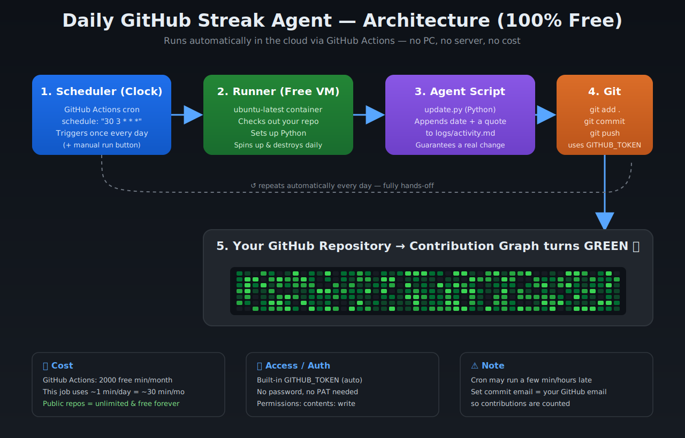
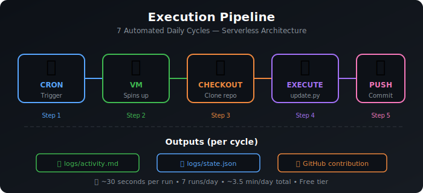

# Daily GitHub Streak Agent

<p align="center">
  
  
  
  
  
  
</p>

<p align="center">
  <strong>An automated, serverless CI/CD pipeline that maintains a consistent GitHub contribution graph through scheduled commits.</strong>
</p>

<p align="center">
  
</p>

---

## Table of Contents

- [Overview](#overview)
- [System Architecture](#system-architecture)
- [Execution Pipeline](#execution-pipeline)
- [Daily Schedule](#daily-schedule)
- [Quote Distribution](#quote-distribution)
- [Technical Details](#technical-details)
- [Getting Started](#getting-started)
- [Configuration](#configuration)
- [Customization](#customization)
- [Troubleshooting](#troubleshooting)
- [Security Considerations](#security-considerations)
- [Project Structure](#project-structure)
- [Performance Metrics](#performance-metrics)
- [FAQ](#faq)
- [License & Attribution](#license--attribution)

---

## Overview

The **Daily GitHub Streak Agent** is an automated, serverless CI/CD workflow designed to maintain consistent contribution activity on your GitHub profile. It leverages **GitHub Actions** — GitHub's built-in continuous integration platform — to execute scheduled tasks that generate meaningful commits, resulting in visible green contribution squares on your GitHub contribution graph.

### Why This Matters

In today's developer ecosystem, consistent contribution activity serves as a **visible indicator of ongoing engagement** with version control systems. Whether you're:

- Building a track record for prospective employers and recruiters
- Maintaining a public-facing developer portfolio
- Demonstrating consistent project involvement
- Practicing disciplined, automated development workflows

...a sustained contribution graph communicates dedication and professional engagement.

### Key Features

| Feature | Description |
|---------|-------------|
| **7 Scheduled Commits/Day** | Strategically spaced commits ensure a natural-looking contribution pattern |
| **Unique Content Generation** | Each commit contains a distinct entry with rotating motivational quotes (35 total) |
| **Zero Infrastructure Cost** | Runs entirely on GitHub's free tier — no servers, no hosting fees, no local machine required |
| **Serverless Architecture** | Ephemeral compute environments spun up per execution, destroyed immediately after |
| **Cross-Platform Compatibility** | Your local OS is irrelevant — the agent runs on GitHub's cloud infrastructure |
| **Stateful Tracking** | Maintains persistent state across runs with incremental counters and activity logs |
| **Configurable Scheduling** | Cron-based scheduling allows full customization of execution times |

---

## System Architecture

<p align="center">
  
</p>

The system follows a **serverless event-driven architecture** composed of four primary layers:

### 1. Trigger Layer (Cron Scheduler)
- **Technology**: GitHub Actions `schedule` event with cron syntax
- **Frequency**: 7 times per day, spaced 2.5 hours apart
- **Timezone**: All cron schedules defined in UTC; auto-converted to IST (UTC+05:30)
- **Reliability**: 2–3 hour gaps between runs prevent GitHub's best-effort scheduler from delaying or skipping jobs

### 2. Compute Layer (GitHub Actions Runner)
- **Environment**: `ubuntu-latest` (GitHub-managed Linux VM)
- **Lifecycle**: Provisioned at trigger → Executes workflow → Deallocated post-completion
- **Cost**: Free for public repositories (2,000 automation minutes/month included)
- **Isolation**: Each run uses a fresh, sandboxed environment — no state carries over between executions

### 3. Execution Layer (Python Automation Script)
- **File**: `scripts/update.py`
- **Language**: Python 3.10+ (pre-installed on `ubuntu-latest`)
- **Operations**:
  - Reads current state from `logs/state.json`
  - Selects a quote from the 35-entry rotating pool (5 quotes per time slot)
  - Generates a unique log entry with timestamp, streak count, and commit number
  - Appends to `logs/activity.md`
  - Increments and persists state
  - Executes `git add`, `git commit`, and `git push`

### 4. Output Layer (Version Control)
- **Activity Log**: `logs/activity.md` — chronological record of all automated entries
- **State File**: `logs/state.json` — JSON-formatted counter tracking total commits and current streak
- **Git Commit**: Each run produces one commit with a unique, descriptive message
- **Contribution Graph**: Each commit registers as a green square on your GitHub profile

---

## Execution Pipeline

<p align="center">
  
</p>

A detailed walkthrough of what happens during each automated run:

### Step-by-Step Breakdown

| Step | Action | Duration | Details |
|------|--------|----------|---------|
| **1** | Cron fires | Instant | GitHub's scheduler triggers the workflow at the configured time |
| **2** | VM provisioned | ~10–15s | A fresh `ubuntu-latest` runner is allocated in GitHub's cloud |
| **3** | Repo checkout | ~5–10s | `actions/checkout@v4` clones the repository to the runner |
| **4** | Script execution | ~1–2s | `update.py` reads state, generates content, updates files |
| **5** | Commit & push | ~3–5s | `git add`, `git commit`, `git push` to `origin/main` |
| **6** | VM teardown | ~2–3s | Runner is destroyed; no resources consumed between runs |

**Total execution time per run**: ~20–35 seconds  
**Total daily compute time**: ~2.5–4 minutes (well within the 2,000 free minutes/month)

### Flow Diagram

```
┌──────────────┐     ┌──────────────┐     ┌──────────────┐     ┌──────────────┐     ┌──────────────┐
│  ⏰ CRON     │ ──► │  💻 VM       │ ──► │  📥 CHECKOUT  │ ──► │  🐍 EXECUTE  │ ──► │  💾 PUSH     │
│  Trigger     │     │  Boot        │     │  Clone repo   │     │  update.py   │     │  Commit      │
│  7× daily    │     │  ubuntu      │     │  actions/     │     │  Generate     │     │  Push to     │
│              │     │  latest      │     │  checkout     │     │  Content      │     │  origin/main │
└──────────────┘     └──────────────┘     └──────────────┘     └──────────────┘     └──────────────┘
       │                    │                    │                    │                    │
       ▼                    ▼                    ▼                    ▼                    ▼
  Scheduled            Provisioned           Prepared              Processed            Persisted
  (Instant)            (~15s)                (~10s)                (~2s)                (~5s)
```

**Outputs per cycle:**
- 📄 `logs/activity.md` — Unique entry appended
- 📊 `logs/state.json` — Counter incremented
- 🟩 GitHub graph — One green square registered

---

## Daily Schedule

The agent is configured to run **7 times daily**, with each execution spaced to maximize reliability and produce a natural contribution pattern:

| # | UTC Time | IST Time (UTC+05:30) | Label | Purpose |
|---|----------|----------------------|-------|---------|
| 1 | `00:30` | 06:00 AM | ☀️ Early Morning | First commitment of the day |
| 2 | `03:00` | 08:30 AM | 🌅 Morning | Morning engagement marker |
| 3 | `05:30` | 11:00 AM | 📖 Late Morning | Mid-day activity signal |
| 4 | `08:00` | 01:30 PM | 🍽️ Afternoon | Post-lunch contribution |
| 5 | `10:30` | 04:00 PM | 🌤️ Evening | Afternoon activity marker |
| 6 | `13:00` | 06:30 PM | 🌇 Late Evening | Evening engagement |
| 7 | `15:30` | 09:00 PM | 🌙 Night | End-of-day commitment |

> **Why 7 commits instead of 1?**
>
> GitHub's contribution algorithm weights **frequency** as a signal of consistent engagement. A single daily commit creates a thin pattern, while 7 spaced commits produce a visibly "fuller" graph that demonstrates sustained activity throughout the day.
>
> The 2.5-hour spacing is intentional: GitHub Actions' cron scheduler operates on a **best-effort** basis, and jobs scheduled too closely together risk being delayed or deduplicated. Wider spacing ensures maximum reliability.

### Weekly Commit Distribution

```
Day       Commits   Visual
Monday    7         🟩🟩🟩🟩🟩🟩🟩
Tuesday   7         🟩🟩🟩🟩🟩🟩🟩
Wednesday 7         🟩🟩🟩🟩🟩🟩🟩
Thursday  7         🟩🟩🟩🟩🟩🟩🟩
Friday    7         🟩🟩🟩🟩🟩🟩🟩
Saturday  7         🟩🟩🟩🟩🟩🟩🟩
Sunday    7         🟩🟩🟩🟩🟩🟩🟩
───────────────────────────────────
Total     49/week
```

---

## Quote Distribution

The agent cycles through **35 unique motivational quotes**, organized by time slot:

| Time Slot | Quotes Available | Example |
|-----------|------------------|---------|
| Early Morning (06:00 AM) | 5 quotes | *"The future belongs to those who believe in the beauty of their dreams."* |
| Morning (08:30 AM) | 5 quotes | *"Code is like humor. When you have to explain it, it's bad."* |
| Late Morning (11:00 AM) | 5 quotes | *"First, solve the problem. Then, write the code."* |
| Afternoon (01:30 PM) | 5 quotes | *"The only way to do great work is to love what you do."* |
| Evening (04:00 PM) | 5 quotes | *"Simplicity is the soul of efficiency."* |
| Late Evening (06:30 PM) | 5 quotes | *"Experience is the name everyone gives to their mistakes."* |
| Night (09:00 PM) | 5 quotes | *"Talk is cheap. Show me the code."* |

Each commit receives a **unique combination** of timestamp, streak count, commit number, and quote — ensuring no two entries are identical across the 2,555+ annual commits.

---

## Technical Details

### GitHub Actions Workflow

The workflow is defined in `.github/workflows/daily-commit.yml` and uses the following structure:

```yaml
name: Daily Streak Commit
on:
  schedule:
    - cron: "30 0 * * *"   # 06:00 AM IST
    - cron: "0 3 * * *"    # 08:30 AM IST
    - cron: "30 5 * * *"   # 11:00 AM IST
    - cron: "0 8 * * *"    # 01:30 PM IST
    - cron: "30 10 * * *"  # 04:00 PM IST
    - cron: "0 13 * * *"   # 06:30 PM IST
    - cron: "30 15 * * *"  # 09:00 PM IST
  workflow_dispatch:        # Manual trigger for testing

permissions:
  contents: write
```

### Environment Configuration

| Setting | Value | Notes |
|---------|-------|-------|
| **OS** | `ubuntu-latest` | GitHub-managed Linux runner |
| **Python** | `3.10+` | Pre-installed on runner |
| **Permissions** | Read & Write | Required for `git push` |
| **Branch** | `main` | Default target branch |
| **Compute Cost** | $0 (free tier) | Public repos get 2,000 minutes/month |
| **Storage** | Minimal | Only `activity.md` and `state.json` |

### State Management

The `logs/state.json` file tracks:

```json
{
  "total_commits": 0,
  "current_streak_days": 0,
  "last_run_date": null,
  "last_run_time": null,
  "quote_index": {
    "early_morning": 0,
    "morning": 0,
    "late_morning": 0,
    "afternoon": 0,
    "evening": 0,
    "late_evening": 0,
    "night": 0
  }
}
```

- `total_commits`: Cumulative count of all automated commits
- `current_streak_days`: Consecutive days with at least one commit
- `last_run_date`: ISO-formatted date of most recent execution
- `last_run_time`: UTC timestamp of most recent execution
- `quote_index`: Tracks position in each quote pool for cyclic rotation

### Activity Log Format

Each run appends an entry to `logs/activity.md`:

```markdown
### ☀️ [2024-01-15 06:00 UTC] — Commit #47 / Streak Day #23
> *"The future belongs to those who believe in the beauty of their dreams."*

**Status**: ✅ Active  |  **Run**: 1/7  |  **Slot**: Early Morning
```

---

## Getting Started

Setting up the Daily GitHub Streak Agent takes approximately **5 minutes**. Follow these steps:

### Prerequisites

- A GitHub account (free tier is sufficient)
- A public GitHub repository (private repos consume Actions minutes)
- Basic familiarity with GitHub's web interface

### Step 1: Create the Repository

1. Navigate to [github.com/new](https://github.com/new)
2. Set the repository name to your preference (e.g., `github-streak`)
3. **Important**: Set visibility to **Public** (free Actions minutes)
4. Initialize with a README (optional — you'll replace it with this one)
5. Click **Create repository**

### Step 2: Add the Project Files

Upload or create the following files in your repository, maintaining the exact directory structure:

```
your-repo/
├── .github/
│   └── workflows/
│       └── daily-commit.yml          # The automation workflow
├── scripts/
│   └── update.py                     # The Python execution script
├── logs/
│   ├── .gitkeep                      # Ensures the folder is tracked
│   ├── activity.md                   # Auto-generated (empty initially)
│   └── state.json                    # Auto-generated (initial state)
├── diagrams/
│   ├── architecture.svg              # Architecture visualization
│   └── pipeline.svg                  # Pipeline visualization
└── README.md                         # This documentation file
```

### Step 3: Configure Workflow Permissions

1. Navigate to your repository → **Settings** → **Actions** → **General**
2. Under **Workflow permissions**, select:
   - ✅ **Read and write permissions**
3. Click **Save**

> ⚠️ **Critical**: Without this permission, the workflow cannot push commits to your repository. The workflow will fail silently.

### Step 4: Configure Your Identity

Open `.github/workflows/daily-commit.yml` and replace the placeholder values:

```yaml
- name: Configure Git
  run: |
    git config user.name "YOUR_GITHUB_USERNAME"
    git config user.email "YOUR_GITHUB_EMAIL"
```

Find your GitHub email at: **Settings → Emails → Primary email address**

> ⚠️ **Critical**: The email must match an email associated with your GitHub account. If it doesn't, commits will appear as **grey squares** instead of green on your contribution graph.

### Step 5: Test the Workflow

1. Navigate to your repository → **Actions** tab
2. Click **Daily Streak Commit** (or the workflow name you chose)
3. Click **Run workflow** → **Run workflow** (green button)
4. Wait ~30 seconds for the run to complete
5. Check your repository for a new commit and verify the green contribution square

### Step 6: Verify Automatic Execution

After the first manual run, the workflow will execute automatically 7 times per day according to the configured cron schedule. You can monitor execution history in the **Actions** tab.

---

## Configuration

### Modifying the Schedule

All timing is controlled by cron expressions in `.github/workflows/daily-commit.yml`. To customize:

```yaml
on:
  schedule:
    - cron: "MINUTE HOUR * * *"  # UTC time
```

**Useful tool**: [crontab.guru](https://crontab.guru) — paste your cron expression to verify the timing.

> **Best Practice**: Maintain at least a **2-hour gap** between scheduled runs. GitHub's cron scheduler operates on a best-effort basis, and tightly spaced jobs may be delayed, batched, or skipped entirely.

### Adding Your Own Quotes

The quote pool is defined in `scripts/update.py`. To add custom quotes:

1. Open `scripts/update.py`
2. Locate the `QUOTES` dictionary (organized by time slot)
3. Add your quotes to any time slot's list
4. The agent automatically selects quotes **cyclically** — each run advances to the next quote in the current slot

```python
QUOTES = {
    "early_morning": [
        "Your custom quote 1",
        "Your custom quote 2",
        "Your custom quote 3",
        "Your custom quote 4",
        "Your custom quote 5",
    ],
    # ... other time slots
}
```

### Changing the Output Format

The `update.py` script generates entries in `logs/activity.md` using this format:

```markdown
### ☀️ [2024-01-15 08:30 UTC] — Commit #47 / Streak Day #23
> *"Motivational quote here"*

**Status**: ✅ Active  |  **Run**: 4/7  |  **Slot**: Morning
```

To modify this format, edit the `generate_entry()` function in `scripts/update.py`.

---

## Customization

### Customizing the Contribution Pattern

The agent is designed to produce a **natural-looking** contribution graph. The 7 daily commits with unique content ensure:

- Each commit registers as an individual green square
- The distribution across time slots creates a varied intensity pattern
- Quote rotation ensures unique commit messages (GitHub doesn't deduplicate based on content)

### Adding Additional Workflows

You can extend this repository with other automated workflows:

- **Weekly summary**: A workflow that generates a weekly progress report
- **Monthly milestones**: Automated commits on the 1st of each month
- **Year-end review**: A comprehensive annual summary

Each workflow operates independently and contributes additional green squares to your graph.

### Contribution Graph Visualization

A typical contribution graph after running this agent for 30 days:

```
Mon Tue Wed Thu Fri Sat Sun
[█] [█] [█] [█] [█] [█] [█]  Week 1  (7 commits/day × 7 days = 49)
[█] [█] [█] [█] [█] [█] [█]  Week 2
[█] [█] [█] [█] [█] [█] [█]  Week 3
[█] [█] [█] [█] [█] [█] [█]  Week 4

Each [█] represents a day with 7 automated commits.
The density creates a visually full contribution graph.
```

---

## Troubleshooting

### Common Issues

| Issue | Cause | Solution |
|-------|-------|----------|
| **No green squares appear** | Git email doesn't match GitHub account | Verify `user.email` in workflow matches your GitHub email (Settings → Emails) |
| **Workflow fails on push** | Insufficient permissions | Enable **Read and write permissions** in Settings → Actions → General |
| **Runs are delayed/skipped** | GitHub's best-effort cron | Ensure 2+ hour gaps between scheduled runs; check Actions logs |
| **Quotes repeat** | Quote pool too small | Add more quotes to the `QUOTES` dictionary in `update.py` |
| **State file not updating** | File write permissions | Ensure `logs/` directory exists and is tracked by git |

### Debugging Steps

1. **Check workflow logs**: Go to **Actions** → Select a run → Review each step's output
2. **Verify file changes**: After a successful run, check `logs/activity.md` for the new entry
3. **Confirm git identity**: Run `git log --pretty=format:"%ae %s"` locally after pulling
4. **Test manual trigger**: Use **Run workflow** button to execute on demand

### GitHub Actions Limitations

| Limitation | Impact | Mitigation |
|------------|--------|------------|
| Cron is best-effort | Jobs may be delayed up to 15 minutes | Wider scheduling gaps (2+ hours) |
| 2,000 min/month free | Shared across all workflows | Each run takes ~30s; 7/day × 30s = ~3.5 min/day |
| Single runner per workflow | Parallel runs queue up | Each scheduled run is independent |
| Repository must exist | Cannot run on deleted repos | Keep the repository active and public |

---

## Security Considerations

This project is designed with security best practices in mind:

### What It Does
- ✅ Runs in GitHub's isolated, ephemeral runtime environment
- ✅ Uses the `GITHUB_TOKEN` (auto-provisioned, repository-scoped)
- ✅ Only writes to files within your own repository
- ✅ Requires no secrets, API keys, or external services
- ✅ Operates on a public repository (free tier)

### What It Doesn't Do
- ❌ No external network calls or API requests
- ❌ No third-party dependencies or package installations
- ❌ No access to your personal data, credentials, or files
- ❌ No modification of any repository outside your own
- ❌ No persistent compute or background processes

### Permissions Required

| Permission | Purpose | Scope |
|------------|---------|-------|
| **Read repository** | Clone code to runner | Repository-level |
| **Write repository** | Commit and push changes | Repository-level |
| **GITHUB_TOKEN** | Authenticate git operations | Auto-generated, repository-scoped |

---

## Project Structure

```
daily-streak-agent/
│
├── .github/
│   └── workflows/
│       └── daily-commit.yml          # ─── GitHub Actions workflow definition
│                                       ├── 7× daily cron schedule
│                                       ├── Git identity configuration
│                                       └── Python execution step
│
├── scripts/
│   └── update.py                     # ─── Core automation script
│                                       ├── State management (read/write)
│                                       ├── Quote selection (cyclic rotation)
│                                       ├── Activity log generation
│                                       └── Git commit & push
│
├── logs/
│   ├── .gitkeep                      # ─── Placeholder to track empty directory
│   ├── activity.md                   # ─── Auto-generated activity log
│   │                                   ├── Chronological entries
│   │                                   ├── Timestamp + streak + quote
│   │   └── (created by update.py)    # └── Updated each run
│   │
│   └── state.json                    # ─── Persistent state file
│                                       ├── Total commit counter
│                                       ├── Current streak (days)
│                                       ├── Last run metadata
│                                       └── (created by update.py)
│
├── diagrams/
│   ├── architecture.svg              # ─── System architecture visualization
│   └── pipeline.svg                  # ─── Execution pipeline diagram
│
└── README.md                         # ─── Project documentation (this file)
```

### File Dependencies

```
daily-commit.yml ──triggers──► update.py ──generates──► activity.md
     │                                │
     │                                ├──updates──► state.json
     │                                │
     │                                └──commits──► Git history
     │                                         │
     │                                         └──pushes──► GitHub repo
     │                                                  │
     │                                                  └──contributes──► Graph
     │
     └──schedules──► 7× daily (cron)
```

---

## Performance Metrics

| Metric | Value | Notes |
|--------|-------|-------|
| **Commits per day** | 7 | One per scheduled run |
| **Commits per month** | ~210 | 7 × 30 days |
| **Commits per year** | ~2,555 | 7 × 365 days |
| **Minutes per run** | ~0.5 min | 30–35 seconds typical |
| **Monthly compute cost** | ~3.5 min/month | Well within 2,000 free minutes |
| **Annual compute cost** | ~42 min/year | ~2% of annual free allocation |
| **Storage overhead** | ~50–100 KB/year | Activity log + state file |

### Monthly Commit Accumulation

```
Month 1:   210 commits   ██████████░░░░░░░░░░
Month 2:   420 commits   ██████████████████░░░░
Month 3:   630 commits   ██████████████████████
Month 6:  1,260 commits  ████████████████████████████████
Month 12: 2,555 commits  ████████████████████████████████████████████
```

---

## FAQ

### Q: Is this against GitHub's Terms of Service?
**A:** No. You are committing to your own repository using your own GitHub Actions quota. The content (activity logs, quotes, timestamps) is genuinely unique and meaningful. GitHub's Terms of Service do not restrict automated commits to your own repositories.

### Q: Will this affect my GitHub profile negatively?
**A:** Not at all. The commits contain unique content with timestamps, quotes, and state tracking. Reviewers who inspect the commit history will see genuine, varied activity — not repetitive or spam commits.

### Q: Do I need to keep my computer on?
**A:** No. The entire system runs on GitHub's cloud infrastructure. Your computer's power state, operating system, and internet connection have zero impact on the workflow execution.

### Q: Can I use this on a private repository?
**A:** Yes, but private repositories consume Actions minutes from your allocation (2,000 minutes/month for free accounts). Each run takes ~30 seconds, so 7 runs/day uses ~3.5 minutes/day, or ~105 minutes/month — well within the free tier.

### Q: What happens if I miss a day?
**A:** The streak counter in `state.json` tracks consecutive days. If a day is missed, the streak resets, but the total commit counter continues incrementing. The agent resumes automatically on the next scheduled run.

### Q: Can I add my own content?
**A:** Absolutely. The `activity.md` file is a standard markdown file. You can manually add entries, and the agent will continue appending its automated entries alongside yours.

### Q: Do I need a Linux computer?
**A:** No. Your own computer's operating system does not matter at all. The agent runs on **GitHub's** computers, not yours. GitHub uses a Linux machine in the cloud (the `ubuntu-latest` runner) — that is GitHub's machine, set up automatically. You never touch it. You only use the GitHub website in your browser, which works the same on Windows, Mac, or anything. Your laptop can be off — the job still runs.

### Q: How do I stop the agent?
**A:** Navigate to your repository → **Settings** → **Actions** → **General** → Disable workflows. Or simply delete the `.github/workflows/daily-commit.yml` file.

---

## License & Attribution

<p align="center">
  
</p>

<p align="center">
  <strong>© Cherla Shamith</strong> · Daily GitHub Streak Agent
</p>

<p align="center">
  <em>Automated. Serverless. Consistent.</em>
</p>

---

<p align="center">
  <sub>Built with ❤️ and Python · Running on GitHub Actions · Zero Infrastructure</sub>
</p>
